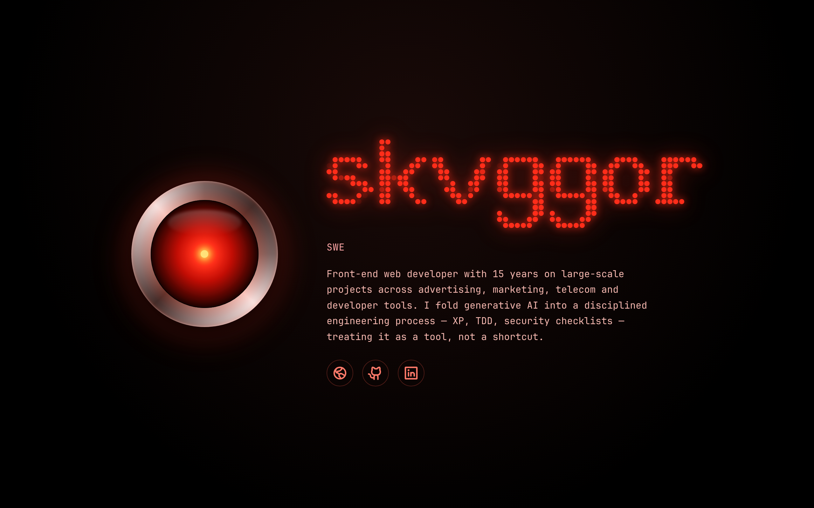

# digital-font

A pixel "display" font for React: each character is a glyph drawn on a
`12×18` grid and rendered as a field of squares. Serif glyphs, with vertical
zones for accents, ascenders, x-height and descenders.

<p align="center">
  
  <br />
  
</p>

## Installation

```bash
npm install digital-font
```

## Usage

```tsx
import { PixelText } from "digital-font";
import "digital-font/styles.css";

export function App() {
  return <PixelText text="HELLO" pixelSize={14} gap={2} color="#16a34a" />;
}
```

## `PixelText` props

| Prop                 | Type               | Default        | Description                                                           |
| -------------------- | ------------------ | -------------- | --------------------------------------------------------------------- |
| `text`               | `string`           | —              | Text to render (required).                                            |
| `pixelSize`          | `number \| string` | `6px`          | Size of each pixel cell.                                              |
| `gap`                | `number \| string` | `1px`          | Gap between pixels.                                                   |
| `letterSpacing`      | `number \| string` | `0.5` cell     | Gap between characters (accepts negative values to tighten).          |
| `color`              | `string`           | `currentColor` | Lit pixel color.                                                      |
| `offColor`           | `string`           | `transparent`  | Unlit pixel color.                                                    |
| `pixelShape`         | `PixelShape`       | `dot`          | Pixel shape: `dot`, `squircle`, `diamond`, `ring`, `square`.          |
| `smartCorners`       | `boolean`          | `false`        | Round outer corners by neighbour analysis (`square`/`squircle` only). |
| `smoothness`         | `number`           | `0.6`          | Rounding strength (`0` retro → `1` organic).                          |
| `proportional`       | `boolean`          | `true`         | Trim per-glyph side-bearing (tight kerning). `false` = monospace.     |
| `spaceWidth`         | `number`           | `4`            | Space character width, in cells.                                      |
| `fluid`              | `boolean`          | `false`        | Width follows the parent; height keeps the aspect ratio.             |
| `gapRatio`           | `number`           | `0.16`         | Pixel gap as a fraction of the pixel (fluid mode).                   |
| `letterSpacingRatio` | `number`           | `0.5`          | Letter gap as a fraction of the pixel (fluid mode).                  |

## Kerning

By default (`proportional`), each glyph is trimmed of its empty side columns
and rendered at its real ink width, with a small, even gap between letters —
instead of the wide, uneven spacing of a monospace canvas. The gap is
adjustable through `letterSpacing` (and `letterSpacingRatio` in fluid mode),
including negative values to overlap letters. Use `proportional={false}` for a
classic monospace display look.

## Fluid width

In `fluid` mode the component becomes a *container query context*
(`container-type: inline-size`) with `width: 100%`, and the pixel size becomes
`calc(100cqw / units)`. Because gaps and spacing are fractions of the pixel,
**everything scales together** — the width fills the parent and the height
follows to keep the aspect ratio, with no runtime measurement.

```tsx
<div style={{ width: "100%" }}>
  <PixelText text="HELLO" fluid color="#fbbf24" />
</div>
```

## Per-pixel animation

Every pixel (lit and unlit) is rendered as a DOM element. Each lit pixel
exposes CSS variables so it can be animated individually:

- `--df-i`: sequential index of the lit pixel across the whole text.
- `--df-n`: total number of lit pixels.
- `--df-row` / `--df-col`: pixel position within the character matrix.

Sweep example:

```css
.my-class .digital-font__pixel--on {
  animation: light-up 1.6s ease-in-out infinite alternate;
  animation-delay: calc(var(--df-i) * 28ms);
}

@keyframes light-up {
  from { opacity: 0.1; transform: scale(0.6); }
  to   { opacity: 1;   transform: scale(1); }
}
```

## Canvas metrics (`12×18`)

| Rows  | Zone           |
| ----- | -------------- |
| 0–2   | Accent         |
| 3–13  | Cap body       |
| 6–13  | x-height       |
| 14–17 | Descender      |

Glyphs are authored as compact string matrices: `#` lit, `.` empty, and the
numpad-mnemonic markers `7 9 1 3` for corner triangles (subpixel smoothing).

## Development

```bash
npm run dev            # visual demo
npm test               # tests
npm run test:coverage  # tests + coverage
npm run build          # build the library + types
```

## Status

The current glyph set is a **pilot** to validate the serif aesthetic and the
rendering pipeline: uppercase `A E H I L M O T`, lowercase `a d l n o p u`,
the accented `á`, and `, . !` plus space. The full character set (Latin
letters, digits and punctuation) is the next step, drawn to the same standard.
